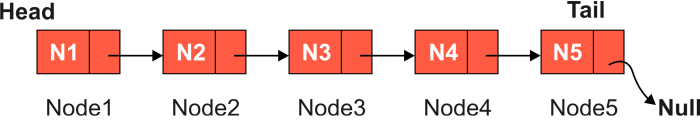

# Linked List
in here we are suppose to create our very own data structure linked list.\
previously data structure like `array` was built in data structure in our programming language. but now will create our own data structure `linked list`

A linked list is a kind of linear dynamic data structure which we use to store data elements. Arrays are also a type of linear data structure where the data items are stored in *continuous memory blocks*.\
Unlike arrays, the linked list does not need to store data elements in contiguous memory regions or blocks.\
A linked list is composed of elements known as "Nodes" that are divided into two parts. The first component is the part where we store the actual data, and the second is a part where we store the pointer to the next node. This type of structure is known as a "`singly linked list.`"

